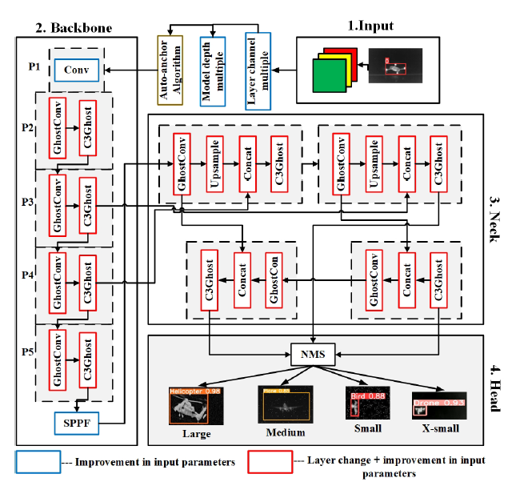

# 🚀 GAANet: Ghost Auto Anchor Network for Detecting Varying Size Drones in Dark

[](https://ieeexplore.ieee.org/document/10200720)
[](https://ieeexplore.ieee.org/stamp/stamp.jsp?tp=&arnumber=10200720)
[](https://app.roboflow.com/tfnet-night-vision/mul/1)
[](https://ieeevtc.org)

Official repository for the IEEE paper:  
**"GAANet: Ghost Auto Anchor Network for Detecting Varying Size Drones in Dark"**  
Published in: *2023 IEEE 97th Vehicular Technology Conference (VTC2023-Spring)*  
📍 Florence, Italy

---

## 📖 Abstract
The rise of drone usage across military, industrial, and civilian sectors has introduced security challenges — especially at night where drones are hard to detect due to their small size and low visibility.  

We propose **GAANet (Ghost Auto Anchor Network)**, a novel deep learning object detection model for infrared (IR) imagery, optimized for **night-time UAV detection**.  

**Key Contributions:**
- ⚡ **Auto-anchor optimization** for better detection of varying drone sizes.
- 🧩 **GhostConv & C3Ghost** modules for lightweight yet efficient feature extraction.
- 🔬 **Extra-small anchor (P2)** for improved tiny-object detection.
- 📉 **AdamW optimizer** for enhanced convergence & regularization.
- 🗂️ **Custom IR dataset** with birds, drones, planes, and helicopters.

---

## 🏗️ Architecture

<p align="center">
  
</p>

- **Input**: Infrared images (multi-class & multi-size targets)  
- **Backbone**: YOLOv5 enhanced with GhostConv & C3Ghost  
- **Neck**: Multi-scale feature fusion with Ghost modules  
- **Head**: Four detection layers (X-small, Small, Medium, Large)  
- **Anchors**: Auto-generated using genetic evolution (fitness = 81.08%)  
- **Optimizer**: AdamW  

---

## 📂 Dataset
We constructed a **custom IR dataset** using [Roboflow](https://app.roboflow.com/tfnet-night-vision/mul/1), consisting of **5105 IR images** with 4 classes:  
- 🐦 Birds  
- 🚁 Drones  
- ✈️ Planes  
- 🚁 Helicopters  

**Properties:**
- Multi-class, multi-size, multi-altitude targets  
- Split: 95% training (4.6k images) / 5% validation (240 images)  
- Designed for **night-vision IR detection under challenging conditions**

👉 Access the dataset here: [Roboflow Dataset](https://app.roboflow.com/tfnet-night-vision/mul/1)

---

## 📊 Results

| Model               | Precision (%) | Recall (%) | mAP@0.5 (%) | Size (MB) |
|----------------------|---------------|------------|-------------|-----------|
| MFNet-M              | 96.8          | 90.4       | 95.9        | 75.3      |
| GhostNet-YOLOv5      | 94.8          | 87.9       | 95.1        | 10        |
| YOLOv5x-ALL-GHOST    | N/G           | N/G        | 97.0        | 48.7      |
| **Proposed GAANet**  | **96.2**      | **90.2**   | **97.6**    | **14.1**  |

**Highlights:**
- 🚀 +2.5% mAP improvement over GhostNet-YOLOv5  
- 🐦 Birds: **98.6% mAP**  
- 🚁 Drones: **97.4% mAP**  
- 🚁 Helicopters: **+18.4% recall vs GhostNet-YOLOv5**  
- ✈️ Planes: **98.4% mAP**  
- ⚡ Average inference: **13.7 ms** (real-time capable)  

---

## 🎥 Video Presentation
Watch the presentation by **Engr. Misha Urooj Khan** explaining GAANet:  

[](https://youtu.be/jstigCgL5sQ)

---

## ⚙️ Installation & Usage

### 1️⃣ Clone Repository
```bash
git clone https://github.com/<your-username>/GAANet.git
cd GAANet

### 2️⃣ Install Dependencies

pip install -r requirements.txt

### 3️⃣ Dataset Preparation

Download the dataset from Roboflow: https://app.roboflow.com/tfnet-night-vision/mul/1
Export in YOLOv5 format.
Place inside datasets/ folder as:
datasets/
  └── gaanet_ir/
      ├── train/
      ├── valid/
      └── data.yaml

### 4️⃣ Training
python train.py --data datasets/gaanet_ir/data.yaml --cfg gaanet.yaml --weights '' --batch-size 256 --epochs 500

### 5️⃣ Evaluation
python val.py --data datasets/gaanet_ir/data.yaml --weights runs/train/gaanet/weights/best.pt

### 6️⃣ Inference
python detect.py --weights runs/train/gaanet/weights/best.pt --source test_images/

## 🔍 Citation

If you use GAANet in your research, please cite:

@INPROCEEDINGS{10200720,
  author={Khan, Misha Urooj and Misbah, Maham and Kaleem, Zeeshan and Deng, Yansha and Jamalipour, Abbas},
  booktitle={2023 IEEE 97th Vehicular Technology Conference (VTC2023-Spring)},
  title={GAANet: Ghost Auto Anchor Network for Detecting Varying Size Drones in Dark},
  year={2023},
  pages={1-6},
  doi={10.1109/VTC2023-Spring57618.2023.10200720}
}

## 🙏 Acknowledgment

This research was supported by:
Higher Education Commission (HEC) Pakistan – NRPU 2021 Grant 15687
Engineering and Physical Sciences Research Council (EPSRC), UK – Grant EP/W004348/1

## 📬 Contact

For queries:
📧 mishauroojkhan@gmail.com
 | mahammisbah33@gmail.com
 | zeeshankaleem@gmail.com

## ⭐ If you found GAANet useful, please give this repo a star!


